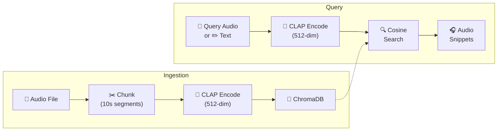

# 🎵 VocalVault — Pure Audio Embedding Retrieval


A Retrieval-Augmented Generation system that operates **entirely in the audio domain** — no speech-to-text anywhere in the pipeline. Audio files are chunked, embedded using [CLAP](https://huggingface.co/laion/larger_clap_music_and_speech), and retrieved via cosine similarity.

## Architecture



## Quick Start

```bash
# 1. Install dependencies
pip install -r requirements.txt

# 2. Run the smoke test (generates synthetic tones & verifies retrieval)
python test_smoke.py

# 3. Launch the Gradio UI
python app.py
```

The UI opens at `http://localhost:7861` with:
- **Left panel** — Upload audio files, manage knowledge base, delete individual sources
- **Right panel** — Record from mic or upload a query audio / type a text description → get top matching segments with similarity percentages

## Project Structure

```
audio-rag/
├── app.py                  # Gradio web UI (dark glassmorphism theme)
├── config.py               # All configuration (paths, model, audio params)
├── requirements.txt        # Python dependencies
├── test_smoke.py           # Automated smoke test with synthetic tones
├── create_sample_query.py  # Generate sample query audio clips
├── rag/
│   ├── audio_processor.py  # Load audio (LRU-cached), chunk, export WAV
│   ├── embedder.py         # CLAP model wrapper (audio → 512-dim vector)
│   ├── vector_store.py     # ChromaDB storage, similarity search, per-source delete
│   ├── retriever.py        # Query embedding, dedup, merge, snippet extraction
│   └── pipeline.py         # Orchestrates ingest() and query() with progress
├── data/                   # Ingested audio files (auto-created, gitignored)
├── vectordb/               # ChromaDB persistent storage (auto-created, gitignored)
└── snippets/               # Extracted result snippets (auto-created, gitignored)
```

## Configuration

All settings in `config.py`:

| Parameter | Default | Description |
|---|---|---|
| `audio.segment_duration` | `10.0` s | Length of each audio chunk |
| `audio.segment_overlap` | `2.0` s | Overlap between chunks |
| `audio.sample_rate` | `48000` Hz | CLAP's expected sample rate |
| `audio.cache_loaded_audio` | `True` | LRU-cache loaded audio files |
| `audio.max_audio_cache` | `8` | Max files in the audio cache |
| `embedding.model_name` | `laion/larger_clap_music_and_speech` | HuggingFace CLAP model |
| `embedding.device` | auto-detect | `cuda` → `mps` → `cpu` fallback |
| `retriever.top_k` | `5` | Number of results to return |
| `retriever.max_distance` | `0.85` | Cosine distance threshold |

## Environment Variables

Override key settings without editing `config.py`:

| Variable | Default | Description |
|---|---|---|
| `VOCALVAULT_DEVICE` | auto-detect | Force compute device: `cuda`, `mps`, or `cpu` |
| `VOCALVAULT_PORT` | `7861` | Gradio server port |
| `VOCALVAULT_SHARE` | `false` | Set to `1` or `true` to create a public Gradio link |
| `VOCALVAULT_BATCH_SIZE` | `8` | Embedding batch size (lower if GPU OOM) |

```bash
# Example: run on CPU with a public link
VOCALVAULT_DEVICE=cpu VOCALVAULT_SHARE=true python app.py
```

## Key Design Decisions

- **No speech-to-text** — Works purely with audio embeddings. Useful for music, environmental sounds, speaker similarity, and any domain where transcription is unwanted.
- **CLAP embeddings** — Contrastive Language-Audio Pretraining model maps audio to a shared embedding space. Supports both audio-to-audio and text-to-audio retrieval.
- **Fixed-duration chunking** — Simple and robust. Audio is split into 10-second segments with 2-second overlap. Trailing segments shorter than 1 second are discarded.
- **ChromaDB** — Lightweight, persistent vector store. No external database required.
- **Auto GPU detection** — Automatically uses CUDA or MPS if available, falls back to CPU.
- **LRU audio caching** — Avoids redundant disk I/O when extracting multiple snippets from the same source file.
- **Duplicate detection** — Files already in the knowledge base are skipped during ingestion.

## Recommended Data

The CLAP model works well with diverse audio types:

| Dataset | Best For | Size |
|---|---|---|
| [ESC-50](https://github.com/karolpiszko/ESC-50) | Environmental sounds (50 categories) | ~600 MB |
| [Common Voice](https://commonvoice.mozilla.org/) | Multi-language speech | Varies |
| [FMA](https://github.com/mdeff/fma) | Music retrieval across genres | ~8 GB (small) |
| [LibriSpeech](https://www.openslr.org/12/) | English speech | ~350 MB (test-clean) |

**Tip:** Start with ESC-50 — its 50 distinct sound categories make text queries like *"dog barking"* or *"rain"* immediately effective.

## Troubleshooting

| Issue | Solution |
|---|---|
| `CUDA out of memory` | Reduce `embedding.batch_size` in `config.py` or set `embedding.device = "cpu"` |
| Slow ingestion for large files | Normal — a 2-hour file produces ~900 segments. Consider splitting into smaller files first |
| `RuntimeError: Failed to decode audio` | File may be corrupted. Try re-encoding with `ffmpeg -i input.mp3 output.wav` |
| ChromaDB lock errors | Only run one instance of the app at a time. Delete `vectordb/` to reset |
| No results returned | Check `retriever.max_distance` — you may need to increase it for dissimilar audio |
